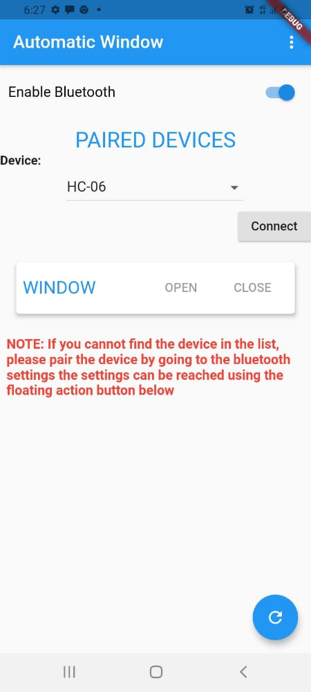
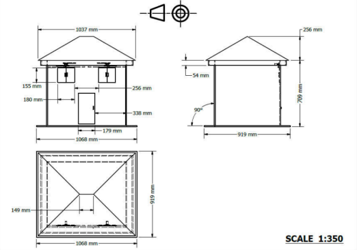
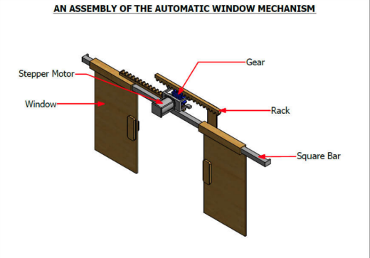

# Flutter Home Automation

Flutter home automation is a project combining the use of flutter and arduino to control home applicances using wireless communication.

<!-- chicken brooder
https://drive.google.com/file/d/1wZSsSa8iQaGPleD2uZIigMibSzaSeYU8/view?usp=sharing -->

<!-- window app
https://drive.google.com/file/d/1aIhEJklTtjfjeB-30QW2-B6ZvfjeeV-g/view?usp=sharing -->

## Key Technologies

- Bluetooth Communication
- Flutter home control
- Servo motors
- Relay Modules

## Code

- Arduino code `./arduino_code`
- Mobile App `./mobile app`

## Working

This project used
The Flutter application handles a gui bluetooth controller which sends signals to the arduio bluetooth setup which controls lights and stepper motors

This project currently controls only a window using a stepper motor

<h3>  Screens from the page</h3>
<!-- 
Screenshot -->

## Publications

List of publications from this project

- [Design and fabrication of model Automatic window in multipurpose halls](https://drive.google.com/file/d/1aIhEJklTtjfjeB-30QW2-B6ZvfjeeV-g/view?usp=sharing)

`feel free to use this project and the codes`
